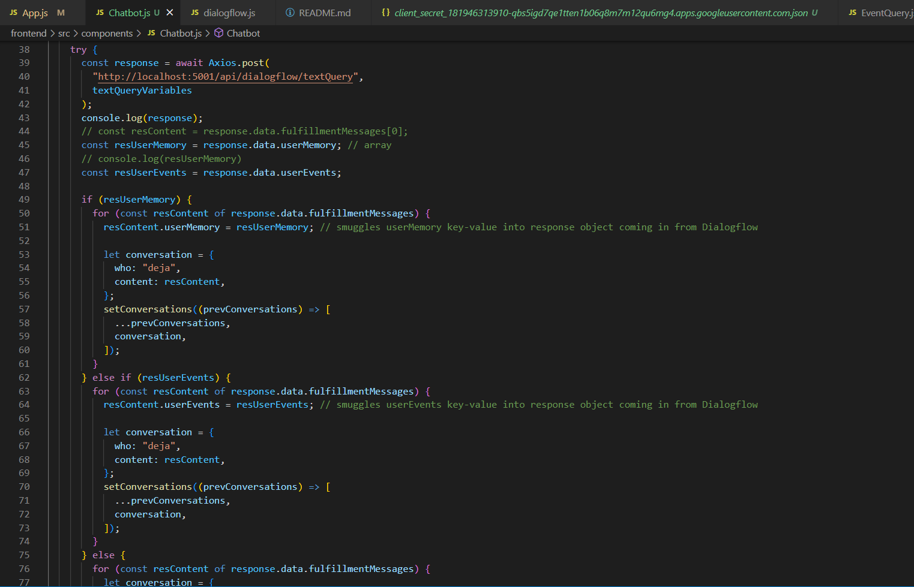
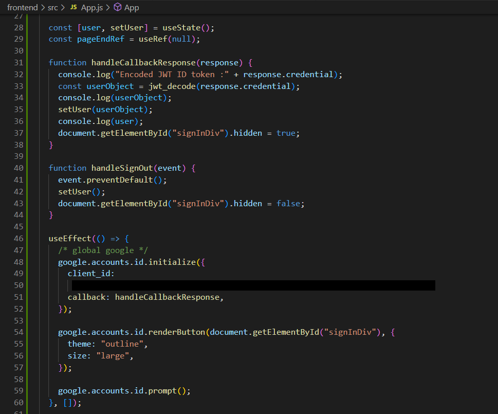
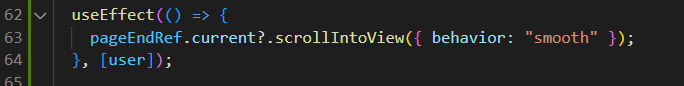
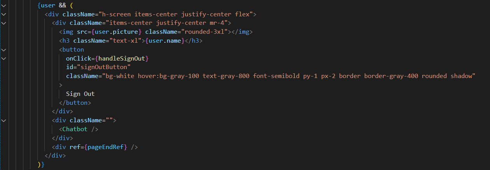
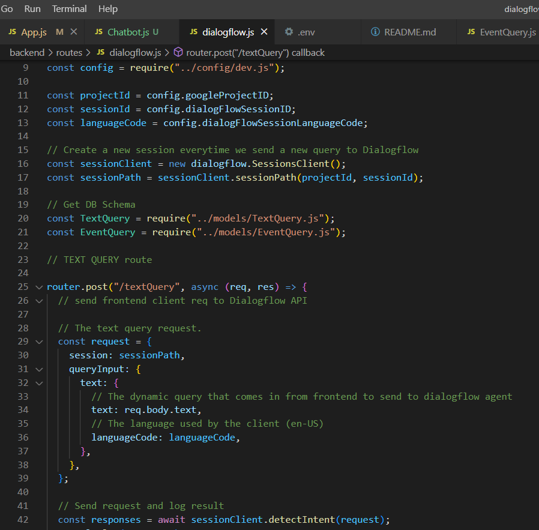
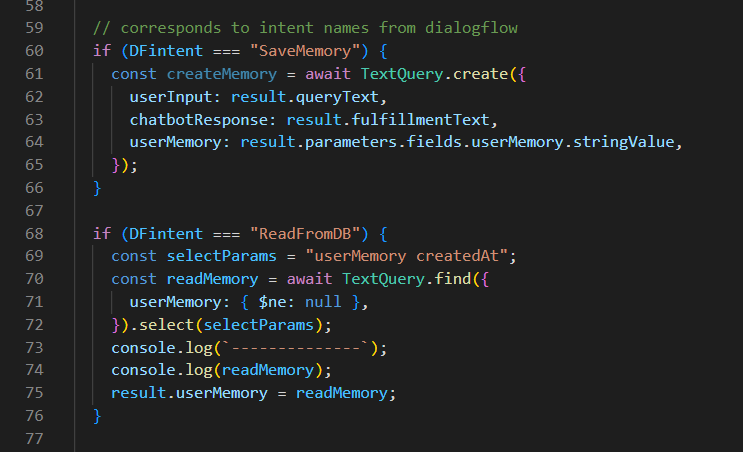

https://www.figma.com/file/jajBmLF2dVEAckhi9YYAAh/DejaDiary-Dataflow?node-id=0%3A1

# About Deja Diary
Deja Diary is a chatbot diary app that's meant to help with journalling on the go. I often find that my best ideas come to me during life's in-between moments, inspiration on the train, the afterglow of conversations with friends. I always tell myself I'll write these ideas down once I get home, or when I have time, but by then I have often forgotten! Journalling is a powerful practice, and while it's never been my strong suit, I'm always texting on my phone, a form of writing that's so close to journaling. So I thought I'd make an app to bridge this problem with a nudge to a proximate solution. Currently still in infancy but I hope to develop this into a fully functional app that I can share with friends.

# Approach Taken
MERN stack linked up with Google's DIALOGFLOW. Dialogflow covers the natural language processing, breathing life into Deja and giving her the verisimilitude of being a conscious interlocutor. 

Currently 2 functionalities: 
SaveMemory - will store a string that you enter like a dear diary entry (triggered by keywords like 'remember', 'dear diary', 'write this down for me', etc.)
    --> recalled with ReadFromDB: this will print the collection of diary entries you've stored before (working on a filter)
ScheduleEvent - will store time, date, location (in the works), eventType, person you're meeting (triggered by simply inputting a sentence with those parameters e.g. "I have a date with Harry tomorrow @ Ion Orchard, 2.45pm")
    --> recalled with RemindEvent: this will print the date and eventType of the event that you've previously stored, and can be filtered by time period e.g. if you ask "What events do I have next week?"

# Technologies used / Points of Interest 

## FRONTEND
1. useState to handle the session's conversations between Deja and User (conversations, setConversations)
    2 types of queries : 
    textQuery (responds to user input)
    eventQuery (fires without user input) 

    textQuery:
    Takes user input, sends to dialogflow, waits for dialogflow's response. Dialogflow's functions are named 'Intents'. Express.js receives the response object with the 'Intent' that Dialogflow has detected, and has corresponding functions that are named the same as Dialogflow's Intents.
    If user makes a call to get back either the saved memories ('ReadFromDB' function) or the saved events schedule ('RemindEvent' function), it will take Dialogflow's NLP response as resUserContent + resUserMemory || resUserEvents from the database, which calls the stored userMemory (diary entries) or the events details (eventType, eventDate, eventPerson, etc).

2. Learnt how to use Gmail for login authentication 

3. Auto scroll-to-section using useRef (set to a html element) & useEffect + conditional rendering of the Chatbot when user successfully logs in

## BACKEND
1. Setting up Dialogflow API calls
    Need to create Dialogflow agent + Google Cloud Service Account. Link those 2, get back account credentials and key, set up GOOGLE_ENVIRONMENT_CREDENTIALS in .env file so it will persist beyond individual shell sessions. 

2. Linking Dialogflow Intents --> Mongoose Functions

# Future Expansions
1. 

